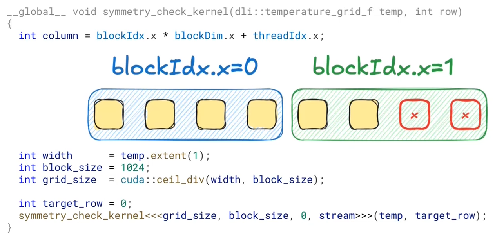

Welcome to my CUDA Sandbox! This repository serves as a playground for experimenting with CUDA C++ and the Thrust library.

For comprehensive documentation on the algorithms and data structures, refer to the [nvidia thrust api](https://nvidia.github.io/cccl/thrust/api_docs/algorithms.html).

# personal notes

- [std::transform](#stdtransform)
- [thrust::transform](#thrusttransform)
- [counting_iterator](#counting_iterator)
- [transform_iterator](#transform_iterator)
- [zip_iterator](#zip_iterator)
- [transform_iterator + zip_iterator](#transform_iterator--zip_iterator)
- [transform_output_iterator](#transform_output_iterator)
- [Notes from Theory](#notes-from-theory)
- [cub vs thrust](#cub-vs-thrust)
- [Nsight Systems](#nsight-systems)
- [cudaStream](#cudastream)
- [pinned memory](#pinned-memory)
- [cuda kernel functions](#cuda-kernels)
    - [boundary check](#boundary-check)
    - [histogram approach](#histogram-approach)

## std::transform
```cpp
std::vector<float> temp{42, 24, 50};

auto op = [=](float temp){
    float diff = ambient_temp - temp;
    return temp + k * diff;
};

std::transform( temp.begin(), temp.end(),   // input
                temp.begin(),               // output
                op);                        // lambda function

for(int i = 0; i <temp.size(); i++){
    temp[i] = op(temp[i]);
}
```

## thrust::transform
```cpp
thrust::universal_vector<float> temp{42, 24, 50};

auto op = [=] __host__ __device__ (float temp){
    float diff = ambient_temp - temp;
    return temp + k * diff;
};

thrust::transform(  thrust::device,             // where to perform the computation: device -> GPU host -> CPU
                    temp.begin(), temp.end(),   // input
                    temp.begin(),               // output
                    op);                        // lambda function

for(int i = 0; i <temp.size(); i++){
    temp[i] = op(temp[i]);
}
```

## counting_iterator
```cpp
struct counting_iterator
{
    int operator[](int i)
    {
        return i;
    }
};
```

## transform_iterator
```cpp
struct transform_iterator
{
    int *a;

    int operator[](int i)
    {
        return a[i] * 2;
    }
};
```

## zip_iterator
```cpp
struct zip_iterator
{
    int *a;
    int *b;

    std::tuple<int, int> operator[](int i)
    {
        return {a[i], b[i]};
    }
};
```

## transform_iterator + zip_iterator
```cpp
struct transform_iterator
{
    zip_iterator zip;
    int operator[](int i)
    {
        auto [a, b] = zip[i];
        return abs(a - b);
    }
};
```

## transform_output_iterator
```cpp
struct wrapper{
    int *ptr;

    void operator=(int value) { *ptr = value / 2; };
};

struct transform_output_iterator{
    int *a;

    wrapper operator[](int i){return {a + i}; }
};

std::array<int, 3> a{0, 1, 2};
transform_output_iterator it{a.data()};

it[0] = 10;
it[1] = 20;

std::printf("a[0]: %d\n", a[0]);    // prints 5
std::printf("a[1]: %d\n", a[1]);    // prints 10
```

## notes from theory


The reason CPU latency is lower—despite the physical proximity of GPU memory—comes down to how their respective memory controllers and hierarchies are optimized.
The CPU is a latency-optimized processor. It is designed to minimize the time it takes to complete a single task (sequential execution). The GPU is a throughput-optimized processor, designed to maximize the total number of tasks completed per second (parallel execution).
Even though DDR4/5 are technically "slower" than GDDR6/6X/7, the CPU wins on latency for several structural reasons:
- the CPU’s L1, L2, and L3 caches are integrated directly onto the silicon.
- The CPU uses massive amounts of die area for "branch prediction" and "speculative execution." It essentially guesses what data you need next and pulls it into the cache before you even ask for it, making the effective latency feel near-zero.
- The CPU memory controller is optimized for "Random Access." When a CPU wants a byte, it wants it now. The GPU memory controller is designed to manage thousands of concurrent requests. To handle this volume, the GPU uses a "scheduler" that bundles requests together. This bundling process adds a "waiting period" (latency) to every single request, even if the bus itself is wide.
GDDR (Graphics DDR) is actually a modified version of standard DDR designed for high frequency and high power consumption at the cost of latency.
- DDR (CPU): Focuses on low CAS (Column Address Strobe) latency. It can switch between different "rows" of memory very quickly.
- GDDR (GPU): Uses a much higher "burst length." It is great at reading a long string of contiguous data (like pixels for a frame) but is relatively sluggish at jumping to a random, unrelated memory address.
In Standard C++: We write code to avoid "cache misses." Because the CPU is so fast, waiting for RAM is a death sentence for performance. We use "Data Oriented Design" to keep things in the L3 cache.
In CUDA C++: We don't try to hide latency with caches as much; we hide it with concurrency. If one "warp" (a group of threads) is waiting for a high-latency memory read from VRAM, the GPU hardware instantly switches to a different warp that is ready to calculate.

## cub vs thrust
To use Aynchronous use of CPU and GPU, to exploit cpu_time in which the cpu is waiting for the gpu to finish, we cannot use 'thrust' (for anything that we want to be asynchronous), instead we can acces the [CUB libabry](https://nvidia.github.io/cccl/cub/).

```cpp
// thrust
auto begin = std::chrono::high_resolution_clock::now();
thrust::tabulate(thrust::device, out.begin(), out.end(), compute);
auto end = std::chrono::high_resolution_clock::now();

// cub
auto begin = std::chrono::high_resolution_clock::now();
auto cell_ids = thrust::make_computing_iterator(0);
cub::DeviceTransform::transform(cell_ids, out.begin(), num_cells, compute);
auto end = std::chrono::high_resolution_clock::now();
```

<table>
<tr>
<td width="65%">
The CPU doesn't wait for the transformation to finish before executing the next instruction (regording end time).
That's why CUB time dowsn't scale with problem size.

</td>
<td width="35%">


</td>
</tr>
</table>

```cpp
auto begin = std::chrono::high_resolution_clock::now();
auto cell_ids = thrust::make_computing_iterator(0);
cub::DeviceTransform::transform(cell_ids, out.begin(), num_cells, compute);
cudaDeviceSynchronize();
// cudaDeviceSynchronize() will force the cpu to wait for the gpu to finish
// resultig in the same behaviour as thrust in this specific istamce
auto end = std::chrono::high_resolution_clock::now();
```
## Nsight Systems
To better visualize what's happening between cpu and gpu nvidia neveloped [Nsight Systems](https://developer.nvidia.com/nsight-systems/get-started).
```bash
!nvcc --extended-lambda -o /tmp/a.out Solutions/compute-io-overlap.cpp -x cu -arch=native # build executable
!sudo nsys profile --cuda-event-trace=false --force-overwrite true -o compute-io-overlap /tmp/a.out # run and profile executable
```

## cudaStream
```cpp
cudaStream_t copy_stream, compute_stream;

// Construct
cudaStreamCreate(&copy_stream);
cudaStreamCreate(&compute_stream);

// Synchronisation
cudaStreamSynchronize(compute_stream);
cudaStreamSynchronize(copy_stream);
// - waits until all preceding commands in the stream have completed
// - more lightweight compared to syncronizing the entire gpu

// Destruction
cudaStreamDestroy(compute_stream);
cudaStreamDestroy(copy_stream);
```
Majority of asynchronous CUDA libraries accept cudaStream_t.
The idea is that you'll likely want to overlap their API with:
- memory transfers,
- host-side compute or IO,
- or even another device-side compute!
```cpp
// CUDA Runtime
cudaStream_t stream = 0;
cudaMemcpyAsync(dst, 
                src, 
                count,  // in bytes
                kind,   // cudaMemcpyKind
                stream
                );
```

```cpp
// CUB
cudaStream_t stream = 0;
cub::DeviceTransform::Transform(input,      // IteratorIn
                                output,     // IteratorOut
                                nu_items,   // int
                                op,         // TransformOp
                                stream
                                );
```

```cpp
// cuBLAS
cudaStream_t stream = 0;
cublasLtMatmul(lightHandle,     // cubLasLtHandle_t
                computeDesc,    // cublasLtmatmulDesc_t
                *alpha,         // const void
                *A,             // const void
                                // ...
                stream
                );
```

If we need to copy data in between computations we can use `cudaStreamSynchronize()` to be sure that the next iteration wont override the data that is currently beein copied from device to host or vice versa. In this way we are going to program different blocks with checkpoint between blocks -> this is fast, but we can do faster.
Since the memory bandwidth on device is usually ~10 times faster that the memory bandwidth on the host, which is already ~3 times faster than the memory bandwidth avaiable on the pci-e bus, copies device to device and host to host are almost free (relative speaking to host to device or device to host).
Examples from [techpowerup.com](https://www.techpowerup.com/gpu-specs/):

                    |  memory bandwidth |
    PCI-E gen 5     |   32.0 GB/s       |
    DDR5@6400MT/s   |   102.0 GB/s      |
    RTX 2070s       |   448.0 GB/s      |
    RTX 5060        |   448.0 GB/s      |
    RTX 5070        |   672.0 GB/s      |
    RTX 3090Ti      |   1.01 TB/s       |
    RTX 5090        |   1.79 TB/s       |

We can introduce a buffer on device (or on the host) to copy the result of teh computation and allow the copy between device and host during the next computation.
```cpp
cudaStream_t copy_stream, compute_stream;   // Create compute and copy sreams
cudaStreamCreate(&compute_stream);
cudaStreamCreate(&copy_stream);

thrust::host_vector<float> hprev(height * width);

// we don't need Async here since device to device should be very fast anyway
thrust::copy(d_prev.begin(), d_prev.end(), d_buffer.begin());   // Synchronously copy into the staging buffer - prevent any datarace
cudaMemcpyAsync(h_temp_ptr, buffer_ptr, num_bytes, cudaMemcpyDeviceToHost, copy_stream);    // Asynchronously copy from staging buffer into host vector within the copy stream

for (int step = 0, step < steps; step++)
{
    sumulate(widt, height, dprev, dnext, compute_stream);   // Launch compute on compute stream
    dprev.swap(dnext);
}

cudaStreamSynchronoze(copy_stream); // wait for copy in the copy stream to finish before reding the data
store(write_step, height, width, hprev);

cudaStreamSynchronize(compute_stream);
```

## pinned memory
Due to paging, stuff in System memory can be moved to Disk memory unless is pinned into System memory. Fortunally the gpu can only read from pinned memory, but the System will move data between pinned memory and unpinned memory every time that need to move data to and from the gpu, transforming our cudaMemcpyAsync int a synchronous copy.
- When you "Pin" memory (using cudaMallocHost), you are telling the OS: "Lock this data down. Do not move it, and do not swap it to the disk."

By using a `thrust::universal_host_pinned_vector` we can force the data to remain into the pinned memory.
```cpp
thrust::host_vector<float> hprev(height * width);
// need to be changed into:
thrust::universal_host_pinned_vector<float> hprev(height * width);
```

## CUDA Kernels
- __host__ functions are invoked and executed by the host (CPU)
- __device__ functions are invoked and executed by the device (GPU)
- __global__  functions are invoked by the host (CPU) and executed by the device (GPU)

when we use a custom function with thrus::make_ and specify __device__, in reality we are specifying that the compiler must generate device code, but underneat the thrust library acts like a wrapper that uses __global__ to invoke the __device__ function from the host and execute within the device.

CUDA Kernels are custom function at the same level as thrust functions so within CUDA Kernels we are required to specify __global__ to allow the __host__ invocation and __device__ execution.

Kernels are:
- launched with a triple chevron syntax <<<?,?,?,stream>>> from the CPU
- executed in `device execution space`
- asynchronous, and
- parallel

```cpp
// thrust/cub - 10 compute steps take 0.000043
void simulate(temperature_grid_f in,
             float *out,
             cudaStream_t stream)
{
    auto ids = thrust::make_counting_iterator(0);
    cub::DeviceTransform::Transform(
        ids, out, in.size(),
        [in] __host__ __device__ (int cell_id){
            return dli::compute(cell_id, in);
        }, stream);
}

// single cuda kernel - 10 compute steps take 4.15
__global__
void single_thread_kernel(dli::temperature_grid_f in, float *out)
{
    for (int id = 0; id < in.size(); id++)
    {
        out[id] = dli::compute(id, in);
    }
}

void simulate(temperature_grid_f in,
             float *out,
             cudaStream_t stream)
{
    single_thread_kernel<<<1, 1, 0, stream>>>(in, out);
}
```
But this implementation is very slow beacuse be are calling a single cuda core to do the whole computation, instead of relying on thrust or cub libraries that are design to parallelise as much as possible.

With CUDA Kernels we need to implement the parallelisation ourself.
```cpp
// 2-threads cuda kernel - 10 compute steps take 2.06
//
const int number_of_threads = 2;
//
//__global__
//void block_kernel(dli::temperature_grid_f in, float *out)
//{
    int thread_index = threadIdx.x; // builtin variables that holds the index of the current thread
    for (int id = thread_index; id < in.size(); id+=number_of_threads)
    {
        out[id] = dli::compute(id, in);
    }
//}
//
//void simulate(temperature_grid_f in,
//             float *out,
//             cudaStream_t stream)
//{
    block_kernel<<<1, number_of_threads, 0, stream>>>(in, out);
//}
```

But there is a limit, an hardware limit
```cpp
// 256-threads cuda kernel - 10 compute steps take 0.037
// 2048-threads cuda kernels - ERROR!
// !! is not possible to launch more than 1024 threads in a thread block!!
//
const int number_of_threads = 2048;
//
//__global__
//void block_kernel(dli::temperature_grid_f in, float *out)
//{
//    int thread_index = threadIdx.x;
//    for (int id = thread_index; id < in.size(); id+=number_of_threads)
//    {
//        out[id] = dli::compute(id, in);
//    }
//}
//
//void simulate(temperature_grid_f in,
//             float *out,
//             cudaStream_t stream)
//{
    block_kernel<<<1, number_of_threads, 0, stream>>>(in, out); // invalid configuration argument
//}
```
### WHY?
- threads are grouped in blocks
- all blocks are the same size (max 1024 threads)
- thread indexing is local within a thread block
- a collection of blocks is called a grid
- blockIdx.x stores the index of current block within the grid
- blockDim.x stores the number of thread in the block
- gridDim.x stores the number of blocks in the grid

### Why 1024 is the maximum number of thread?
1024 is not a random number, but is 128 * 32 which is the maximum number of trhead that a single Streaming Multiprocessor can handle inide an Nvidia GPU.
Each GPU is coposed by several `SM` (84 in an RTX 3090 Ti and 170 in an RTX 5090 for example) and each `SM` has 128 cores that share the same L1 cache. 
Moreover Nvidia implemented `Warp` as a way to better use each core and hide the latency required for memory access.
Each core inside a `SM` execute one out of those 32 per cycle and can fetch data for the next `Warp` in the meantime, de facto defining 32 thread for each core for each `SM`.

`Thread block sie doesn't depend on problem size, there is no block size that fits all kernels.`

As a rule of thumb:
- use block size that are multiple of 32
- use 256 as a good default
- profile for further tuning

`Instead grid size frequently depend on problem size.`
As a rule of thumb, use `cuda::ceil_div` to compute grid size.
```cpp
// 5.120.000-threads cuda kernel - 10 compute steps take 0.0003
//
//__global__
void grid_kernel(dli::temperature_grid_f in, float *out)
//{
    int thread_index = blockDim.x * blockIdx.x + threadIdx.x;
//    for (int id = thread_index; id < in.size(); id+=number_of_threads)
//    {
//        out[id] = dli::compute(id, in);
//    }
//}
//
int ceil_div(int a, int b)
{
    return (a + b - 1) / b;
}
//
//void simulate(temperature_grid_f in,
//             float *out,
//             cudaStream_t stream)
//{
    int block _size = 256;
    int grid_size = cuda::ceil_div(in.size(), block_size);
    grid_kernel<<<grid_size, block_size, 0, stream>>>(in, out);
//}
```
Example: Detect Asymmetry
```cpp
void symmetry_check(dli::temperature_grid_f temp, int row)
{
    int column = 0;

    float top = temp(row, column);
    float bottom = temp(temp.extent(0) - 1 - row, column);
    float diff = abs(top - bottom);
    if (diff > 0.1) {
        printf("Error: asymmetry in %d\n", column);
    }
}
```
```cpp
__global__ void symmetry_check_kernel(dli::temperature_grid_f temp, int row)
//{
    int column = blockIdx.x * blockDim.x + threadIdx.x;
//
//    if (abs(temp(row, column) - temp(temp.extent(0) - 1 - row, column)) > 0.1) {
//        printf("Error: asymmetry in %d\n", column);
//    }
//}
//
void symmetry_check(dli::temperature_grid_f temp, int row)
{
    int width       = temp.extent(1);
    int block_size  = 256;
    int grid_size   = cuda::ceil_div(width, block_size);

    int target_row  = 0;
    symmetry_check_kernel<<<1, 1, 0, stream>>>(temp, target_row);
}
```
-> ERROR!!
By rounding up the number of threads to be sure to have at least one thread for each element of the problem we might have more threads than elemets and we can incour in an out of bound error in which on ore more threads will try to access an element that doesn't exists.


## Boundary check
```cpp
//__global__ void symmetry_check_kernel(dli::temperature_grid_f temp, int row)
//{
    int column = blockIdx.x * blockDim.x + threadIdx.x;
//
    if (column < temp.extent(1)) // check if a given thread is whitin bounds of problem size
    {
//    if (abs(temp(row, column) - temp(temp.extent(0) - 1 - row, column)) > 0.1) {
//        printf("Error: asymmetry in %d\n", column);
//    }
    }
//}
```


## Histogram approach
lesson3::24:33